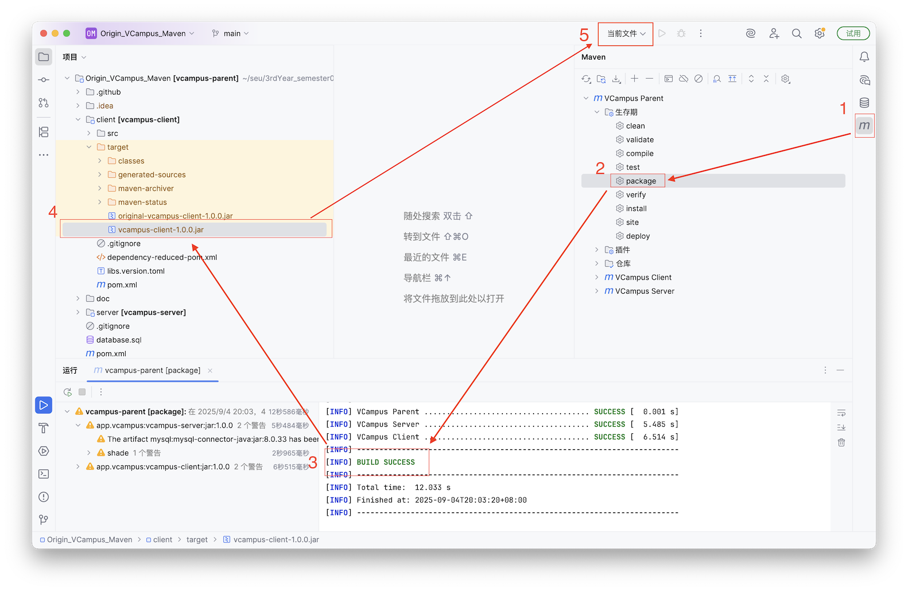
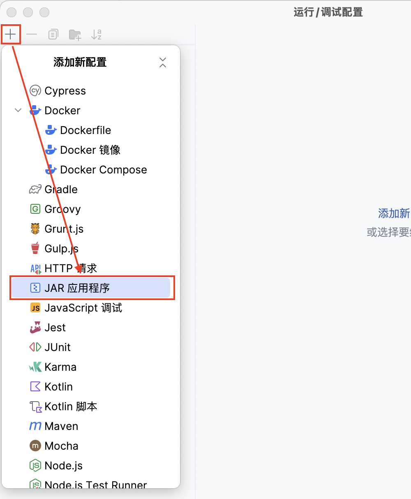
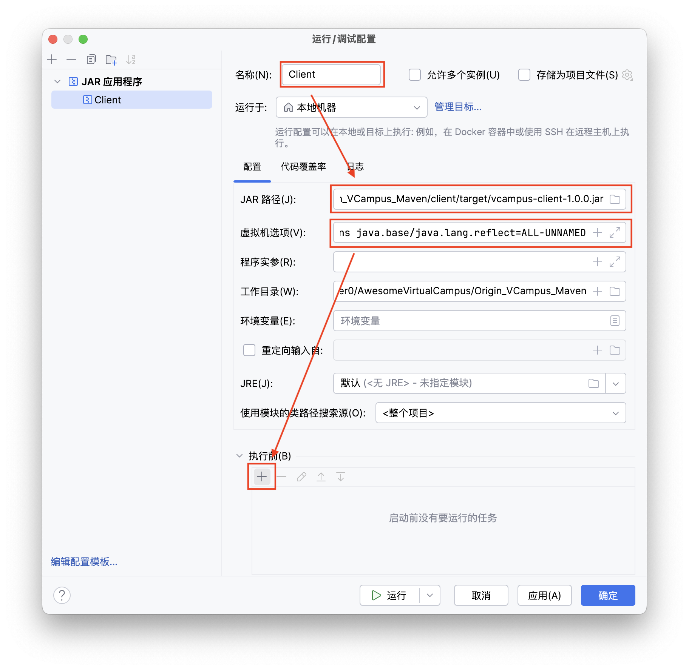
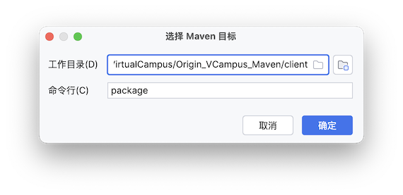

# 开发者指南

> [!CAUTION]
>
> 本文的内容可能已过时。请参考标题为 SEU - 2025 Summer School - VCampus 的 README.md。

## 配置 IDEA

1. 首先执行 `clone`将代码拉至本地

```bash
git clone https://github.com/zeroffa233/AwesomeVirtualCampus.git
```

2. 用 `IntelliJ IDEA` 打开 `AwesomeVirtualCampus/Origin_VCampus_Maven`
3. 若`IDEA`提示 “检测到Hibernate框架” ，点击 “配置” ，而后在弹出的窗口点击“确定”

### 配置 Client 以一键打包并运行
<div align="center">

</div>
1. 如上图，先轻点右侧的  `Maven` 插件，在弹出的窗口中展开 `生存期` 菜单，选择`package`
2. 待 `BUILD SUCCESS` 字样出现后，在左侧项目菜单中找到`vcampus-client-1.0.0.jar`，而后点击右上角的 `当前文件` ，在出现的菜单中选择 `编辑配置`。


<div align="center">

</div>

3. 在弹出的窗口中点击左上角的加号，添加一个新配置，选择 `JAR应用程序` 
<div align="center">

</div>
4. 在窗口右侧，依次设置`名称`，`JAR路径`，`虚拟机选项`。其中`虚拟机选项`为如下内容。配置好虚拟机选项后，点击 “执行前” 部分的加号，选择“运行Maven目标”


```bash
--add-opens java.base/java.lang.reflect=ALL-UNNAMED
```
<div align="center">

</div>
5. 在弹出的窗口选择`Maven`目标，注意工作目录并不是默认而是`/client`，命令行写 `package` 。
6. 一路确定，配置好后，选中`IDEA`右上角的`Client`（即刚刚生成的配置名称，因人而异），然后运行。此时即可一键打包并运行`Client`

### 配置 Server 以一键打包

可参考 Client 的配置方法，配置一个 `Maven` 选项，“运行”一栏填 `package`，工作目录为`vcampus-server`，

> [!IMPORTANT]
>
> Serevr 是一个**命令行**程序，**请在终端中运行**。若在 `IDEA` 中尝试运行 Server ，可能会提示 “控制台不可用。请在终端中运行此程序！”。

```bash
xxxxxxxxxx java -jar path/vcampus-server-1.0.0.jar #请将这里的path替换为正确的路径 [database.sql](../../Origin_VCampus_Maven/database.sql)  
```

> [!IMPORTANT]
>
> 在尝试运行 Server 之前，请确保启动了 MySQL Server 并配置好数据库。
>
> 注意本地数据库的名字**一定**要是vcampus！！！不要修改程序源代码。

以下是相关命令

```bash
mysql -u root -p
mysql> CREATE DATABASE vcampus; # 注意，这里数据库的名称必须是 vcampus 
mysql> USE vcampus;
mysql> SOURCE /path/to/file.sql;
mysql> SHOW TABLES; # 检查
```

## 可能存在的问题

### Q：为什么打包后，`/target` 文件夹下会有两个 `.jar` 包？

> [!NOTE]
>
> 本节内容由 AI 辅助生成

A：因为项目中使用了 **maven-shade-plugin** 插件，该插件会创建一个**包含所有依赖**的可执行“胖” JAR。Maven 默认插件创建的、**不包含依赖**的原始 JAR会带有`origin`前缀。

> maven-shade-plugin 的工作流程如下：
>
> 1. **默认打包**：在 Maven 的 package生命周期阶段，maven-jar-plugin 会首先被触发。它会根据您项目的 src/main/java和 src/main/resources 目录，创建一个标准的、只包含您自己项目代码的 JAR 包。此时，这个包的名字是 vcampus-client-1.0.0.jar。
> 2. **Shade 插件执行**：紧接着，您配置的 maven-shade-plugin 会在同一个 package 阶段运行。它的目标（shade）是创建一个包含所有依赖的“胖”JAR（Uber JAR）。
> 3. **重命名与替换**：Shade 插件会拿起第 1 步中生成的那个标准 JAR，并将您项目的所有依赖项（如 netty, gson, javafx 等）解压并合并进去。为了不丢失最原始的那个标准 JAR，Shade 插件会**将其重命名为 original-vcampus-client-1.0.0.jar**。
> 4. **生成最终产物**：最后，Shade 插件将合并了所有内容的新“胖”JAR 保存为项目的主要构建产物，并使用原始名称 vcampus-client-1.0.0.jar。